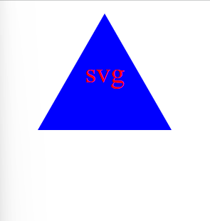

# SVG Logo Maker

## Description

This project uses inquirer for generating SVG file.

## Usage

The user will be prompted for information about their svg-logo. After that svg file will be generated with the text, color, and shape user choose.

Go to [Video demonstrating the functionality of the application](https://drive.google.com/file/d/1owsW8e6ayydnkyxRNh4PXgwEO2Q5d9ou/view?usp=drive_link)

A sample README.md file generated using Readme Generator.

## Questions
### Use the links below if you have any questions.
- Email Address - [armanbarseghyan83@gmail.com](mailto:armanbarseghyan83@gmail.com)
- Linkedin - [https://www.linkedin.com/in/arman-barseghyan](https://www.linkedin.com/in/arman-barseghyan)
- GitHub Profile - [https://github.com/ArmanBarseghyan83](https://github.com/ArmanBarseghyan83)
